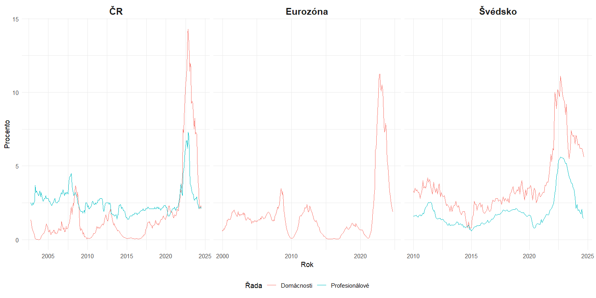
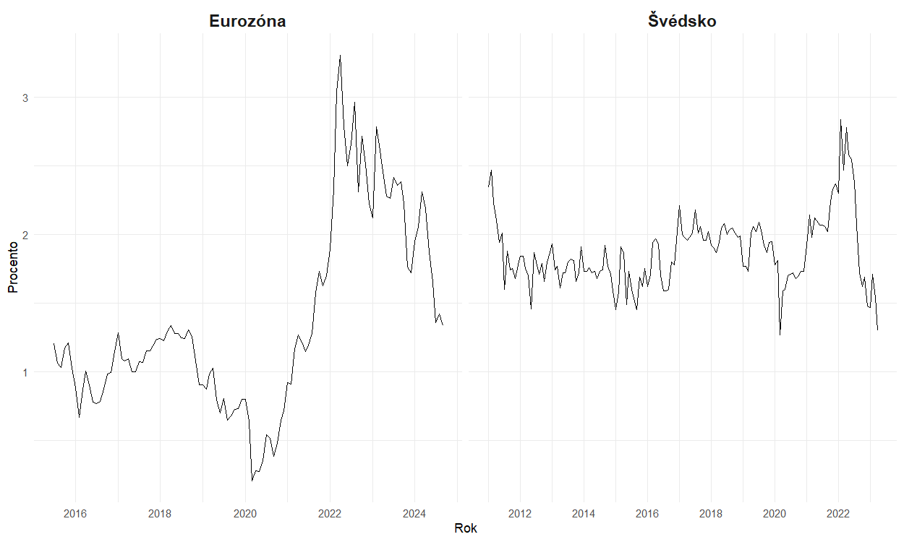
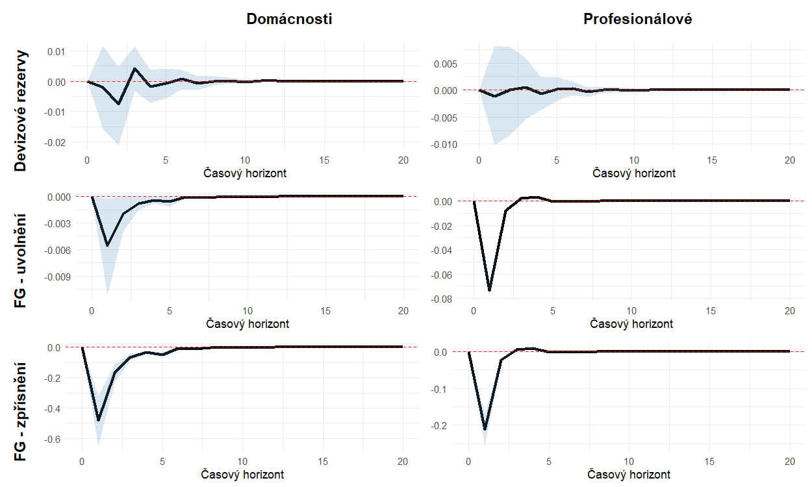
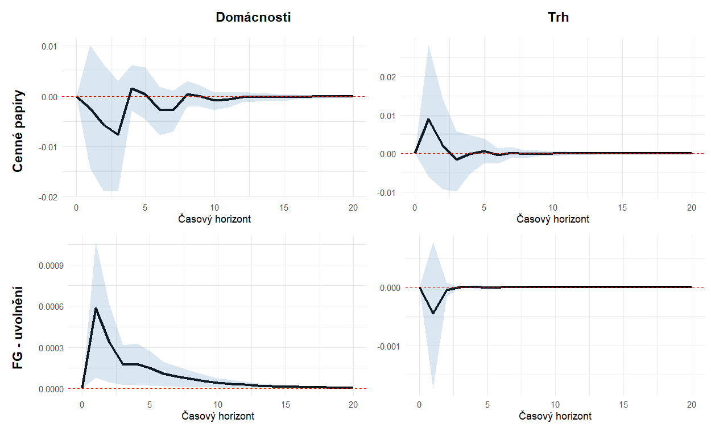
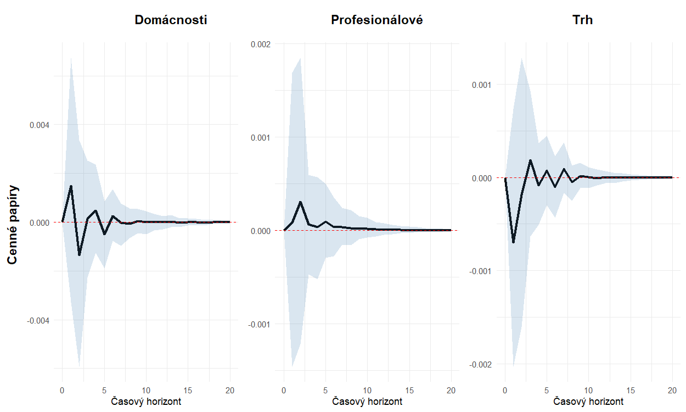

# The impact of unconventional monetary policy on inflation expectations - Bachelor’s Thesis

This is my Bachelor’s Thesis project which aims to analyse unconventional monetary tools impact on inflation expectations in Czech republic, euroarea, Sweden. Analysis contains thesis level report and unusual-manually created data of central bank public reports. This data are then modeled as exogenous dummy variables in VAR model.
Analysis also creates custom market derived inflation expectation data from Nominal and Inflation indexed Bond yield.
Project code also includes Impulse response function written from scratch for exogenous "shock" (shock in exogenous variable) in VAR model as R currently doesn't provide this functionality.

**Thesis text (analysis report) is available (in Czech) at:**
https://is.muni.cz/th/dzkyy/?fakulta=1421;obdobi=181;lang=cs;id=300358

**There is also local version in this repo: [As PDF](/Vliv_nekonvencni_monetarni_politiky_na_inflacni_ocekavani.pdf) [As DOCX](/Vliv_nekonvencni_monetarni_politiky_na_inflacni_ocekavani.docx)**

## Tools used
- R (Tidyverse)
- VAR model with exogenous variables
- Impulse reponse functions

## Abstract
This project aims to examine how unconventional monetary policy has influenced inflation expectations of selected economic agents in the Czech Republic, the euro area and Sweden. To achieve this goal, the vector autoregression method is used, potentially extended with exogenous variables. The results show that quantitative easing has no statistically significant impact the inflation expectations of individual agents. In contrast, forward guidance aimed at loosening policy shows a predominantly significant effect, both positive and negative. Forward guidance signalling tightening of monetary policy shows a significant negative effect.

## Outcomes

**Household and Profesional analytics inflation expectations of each area:**

**Market derived inflation expectations for euroarea and Sweden:**

### Impulse response functions of available Inflation expectations for each area
- (key outcome of analysis)

**CZ:**

**EA:**

**SWE:**

